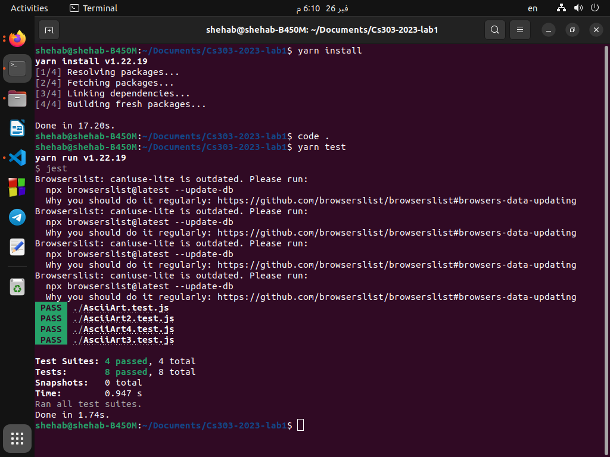

## The assignment
### Rules
ASCII art allows you to represent forms by using characters. To be precise, in our case, these forms are words. For example, the word "MANHATTAN" could be displayed as follows in ASCII art:
```
# #  #  ### # #  #  ### ###  #  ###
### # # # # # # # #  #   #  # # # #
### ### # # ### ###  #   #  ### # #
# # # # # # # # # #  #   #  # # # #
# # # # # # # # # #  #   #  # # # #
```
​Your mission is to edit AsciiArt.js file and write a program that can display a line of text in ASCII art in a style you are given as input.

#### Function Input
##### Input
* width: the width of a letter represented in ASCII art. All letters are the same width.
* height: the height of a letter represented in ASCII art. All letters are the same height.
* text: The line of text, composed of N ASCII characters.
* alphabet: the string of characters ABCDEFGHIJKLMNOPQRSTUVWXYZ? Represented in ASCII art.

##### Output
* The text in ASCII art.
* The characters a to z are shown in ASCII art by their equivalent in upper case.
* The characters that are not in the intervals [a-z] or [A-Z] will be shown as a question mark ? in ASCII art.
##### Constraints
0 < L < 30

0 < H < 30

0 < N < 200

#### Example 1
##### Input
```
4, 5, E, 
[" #  ##   ## ##  ### ###  ## # # ###  ## # # #   # # ###  #  ##   #  ##   ## ### # # # # # # # # # # ### ### ",
  # # # # #   # # #   #   #   # #  #    # # # #   ### # # # # # # # # # # #    #  # # # # # # # # # #   #   # ",
  ### ##  #   # # ##  ##  # # ###  #    # ##  #   ### # # # # ##  # # ##   #   #  # # # # ###  #   #   #   ## ",
  # # # # #   # # #   #   # # # #  #  # # # # #   # # # # # # #    ## # #   #  #  # # # # ### # #  #  #       ",
  # # ##   ## ##  ### #    ## # # ###  #  # # ### # # # #  #  #     # # # ##   #  ###  #  # # # #  #  ###  #  "]
```
##### Output
```
### 
#   
##  
#   
### 
```
#### Example 2
##### Input
```
4, 5, MANHATTAN,
 #  ##   ## ##  ### ###  ## # # ###  ## # # #   # # ###  #  ##   #  ##   ## ### # # # # # # # # # # ### ### 
# # # # #   # # #   #   #   # #  #    # # # #   ### # # # # # # # # # # #    #  # # # # # # # # # #   #   # 
### ##  #   # # ##  ##  # # ###  #    # ##  #   ### # # # # ##  # # ##   #   #  # # # # ###  #   #   #   ## 
# # # # #   # # #   #   # # # #  #  # # # # #   # # # # # # #    ## # #   #  #  # # # # ### # #  #  #       
# # ##   ## ##  ### #    ## # # ###  #  # # ### # # # #  #  #     # # # ##   #  ###  #  # # # #  #  ###  #  
```
##### Output
```
# #  #  ### # #  #  ### ###  #  ###  
### # # # # # # # #  #   #  # # # #  
### ### # # ### ###  #   #  ### # #  
# # # # # # # # # #  #   #  # # # #  
# # # # # # # # # #  #   #  # # # # 
```
The tests are failing right now because we're not returning the correct string. Fixing this up will make the tests green.

### Setup command
`yarn install`

### Run command
`yarn test`

### Notes
Your grade will be calculated based on more test cases that are not included in the repo.

### Result

